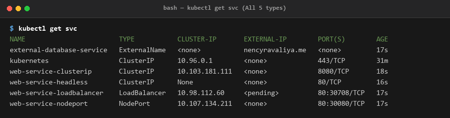
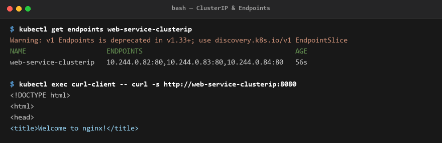
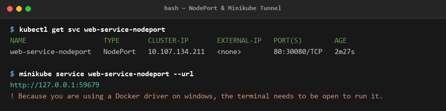
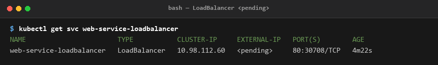
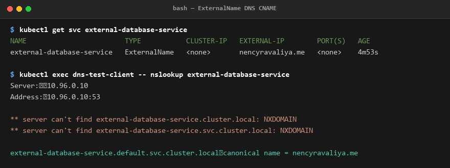
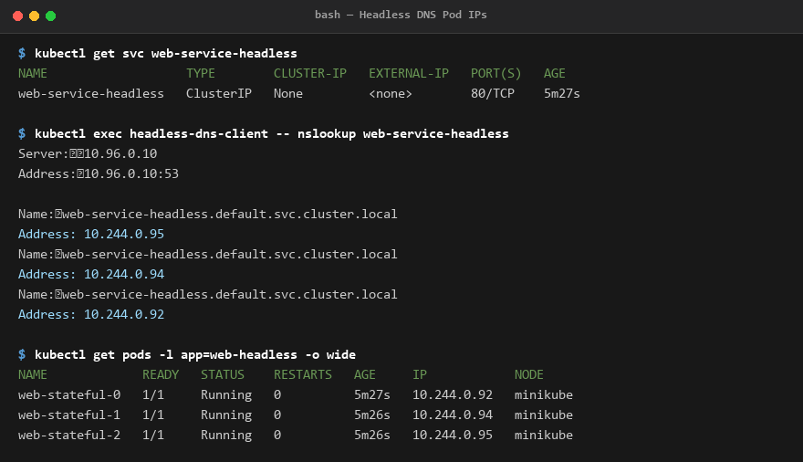

# Session 11 - Kubernetes Services

**Name:** Jatin Mangtani  
**Enrollment Number:** 24BCS10118  

---

Applied all 5 service types from the session folders and tested how each one is reached. Output is copied from my terminal.

```bash
$ kubectl get svc
NAME                        TYPE           CLUSTER-IP       EXTERNAL-IP        PORT(S)        AGE
external-database-service   ExternalName   <none>           nencyravaliya.me   <none>         17s
kubernetes                  ClusterIP      10.96.0.1        <none>             443/TCP        31m
web-service-clusterip       ClusterIP      10.103.181.111   <none>             8080/TCP       18s
web-service-headless        ClusterIP      None             <none>             80/TCP         16s
web-service-loadbalancer    LoadBalancer   10.98.112.60     <pending>          80:30708/TCP   17s
web-service-nodeport        NodePort       10.107.134.211   <none>             80:30080/TCP   17s
```



All five in one table. The `CLUSTER-IP` column already tells most of the story - a normal IP for ClusterIP/NodePort/LoadBalancer, `None` for headless, and nothing at all for ExternalName.

---

## 1. ClusterIP

```bash
kubectl apply -f 01-clusterip/app-deployment.yaml
kubectl apply -f 01-clusterip/service.yaml
kubectl apply -f 01-clusterip/client-pod.yaml
```

```bash
$ kubectl get endpoints web-service-clusterip
Warning: v1 Endpoints is deprecated in v1.33+; use discovery.k8s.io/v1 EndpointSlice
NAME                    ENDPOINTS                                      AGE
web-service-clusterip   10.244.0.82:80,10.244.0.83:80,10.244.0.84:80   56s

$ kubectl exec curl-client -- curl -s http://web-service-clusterip:8080
<!DOCTYPE html>
<html>
<head>
<title>Welcome to nginx!</title>
```



The `ENDPOINTS` column is the part that made services click for me. The service is not doing anything clever - it just keeps a list of the pod IPs that match its selector (three pods here, `.82`, `.83`, `.84`). If a pod dies, its IP drops off the list and a new one gets added. The name stays the same the whole time, which is the point.

Note the port mapping: `port: 8080` is what I curl, `targetPort: 80` is where nginx actually listens. They don't have to match.

The deprecation warning is just Kubernetes moving from `Endpoints` to `EndpointSlice` - same information, newer object.

---

## 2. NodePort

```bash
$ kubectl get svc web-service-nodeport
NAME                   TYPE       CLUSTER-IP       EXTERNAL-IP   PORT(S)        AGE
web-service-nodeport   NodePort   10.107.134.211   <none>        80:30080/TCP   2m27s

$ minikube service web-service-nodeport --url
http://127.0.0.1:59679
! Because you are using a Docker driver on windows, the terminal needs to be open to run it.
```



`80:30080/TCP` means port 80 inside the cluster, port 30080 on the node itself. So anyone who can reach the node IP can hit the app on 30080. NodePort is still a ClusterIP underneath - it just adds the port on the node on top.

One thing I hit: on Windows with the Docker driver I can't just browse to `<node-ip>:30080`, because the node is a container inside a VM. `minikube service --url` makes a tunnel and gives a localhost URL instead (`127.0.0.1:59679` here - a random local port, not 30080). That command has to keep running to keep the tunnel open.

---

## 3. LoadBalancer

```bash
$ kubectl get svc web-service-loadbalancer
NAME                       TYPE           CLUSTER-IP     EXTERNAL-IP   PORT(S)        AGE
web-service-loadbalancer   LoadBalancer   10.98.112.60   <pending>     80:30708/TCP   4m22s
```



`EXTERNAL-IP` is stuck on `<pending>` and that is not a bug. LoadBalancer asks the cloud provider (AWS/GCP/Azure) to go create a real load balancer and hand back an IP. On minikube there is no cloud provider, so nobody ever answers and it waits forever.

`minikube tunnel` fakes one if I want an actual IP. Notice it still got a node port (30708) - LoadBalancer builds on NodePort, which builds on ClusterIP.

---

## 4. ExternalName

```bash
$ kubectl get svc external-database-service
NAME                        TYPE           CLUSTER-IP   EXTERNAL-IP        PORT(S)   AGE
external-database-service   ExternalName   <none>       nencyravaliya.me   <none>    4m53s

$ kubectl exec dns-test-client -- nslookup external-database-service
Server:		10.96.0.10
Address:	10.96.0.10:53

** server can't find external-database-service.cluster.local: NXDOMAIN
** server can't find external-database-service.svc.cluster.local: NXDOMAIN

external-database-service.default.svc.cluster.local	canonical name = nencyravaliya.me
```



This one has no CLUSTER-IP and no selector and no pods. It is purely a DNS alias - CoreDNS just returns a CNAME pointing somewhere outside the cluster.

Why it's useful: my app can always say `external-database-service` and if the real database address changes later I only edit the service, not the app. Also handy when moving a database into the cluster later - the name my app uses never changes.

---

## 5. Headless Service

```bash
$ kubectl get svc web-service-headless
NAME                   TYPE        CLUSTER-IP   EXTERNAL-IP   PORT(S)   AGE
web-service-headless   ClusterIP   None         <none>        80/TCP    5m27s

$ kubectl exec headless-dns-client -- nslookup web-service-headless
Server:		10.96.0.10
Address:	10.96.0.10:53

Name:	web-service-headless.default.svc.cluster.local
Address: 10.244.0.95
Name:	web-service-headless.default.svc.cluster.local
Address: 10.244.0.94
Name:	web-service-headless.default.svc.cluster.local
Address: 10.244.0.92

$ kubectl get pods -l app=web-headless -o wide
NAME             READY   STATUS    RESTARTS   AGE     IP            NODE
web-stateful-0   1/1     Running   0          5m27s   10.244.0.92   minikube
web-stateful-1   1/1     Running   0          5m26s   10.244.0.94   minikube
web-stateful-2   1/1     Running   0          5m26s   10.244.0.95   minikube
```



`clusterIP: None` is what makes it headless. Instead of one virtual IP, the DNS lookup returns **all three pod IPs** - and they match the 3 statefulset pods exactly (`.92`, `.94`, `.95`).

So there is no load balancing here at all. The client gets the real list and picks itself. That's what databases need - with a MySQL cluster I have to talk to the primary specifically, not "whichever one kube-proxy feels like". StatefulSet also gives each pod a stable name, so I can address `web-stateful-0.web-service-headless` directly.

---

## What I learned

1. **Hierarchy**: The three "normal" types stack on each other: ClusterIP gives an internal IP, NodePort adds a port on the node, LoadBalancer adds a cloud LB in front. So a LoadBalancer service has all three.
2. **Dynamic Endpoint Matching**: Services find pods by **labels**, not by names or IPs. If the selector doesn't match any pod labels, the `ENDPOINTS` list comes back empty and requests fail.
3. **Internal DNS Structure**: The DNS name is always `<service>.<namespace>.svc.cluster.local`. Inside the same namespace the short name works because of the search path in `resolv.conf`, which is also why `nslookup` printed those NXDOMAIN lines first - it tries each suffix until one hits.
