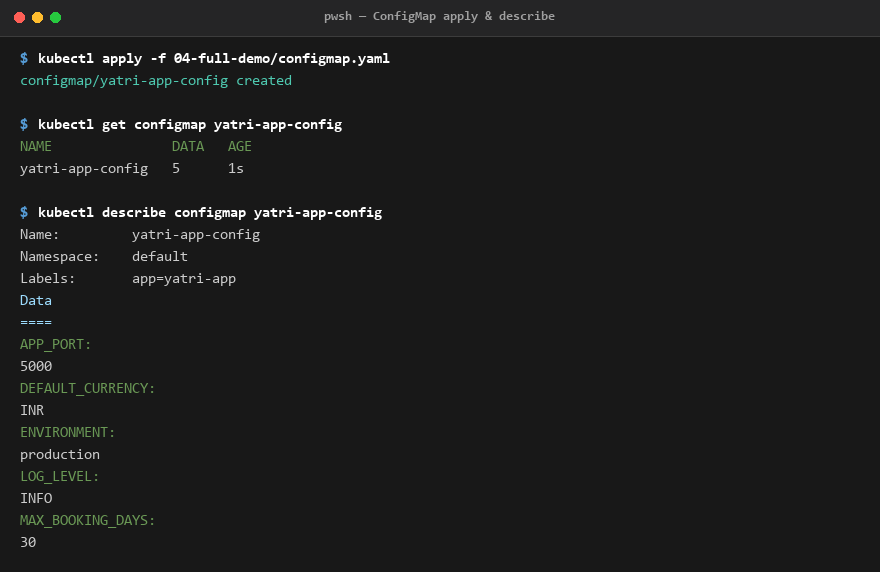
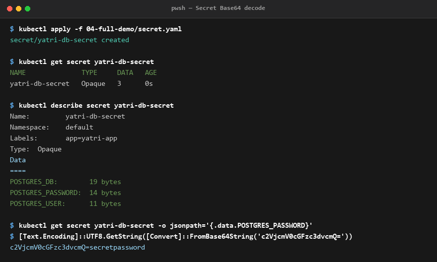
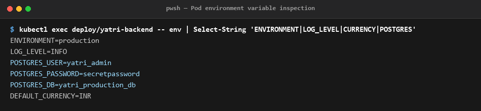
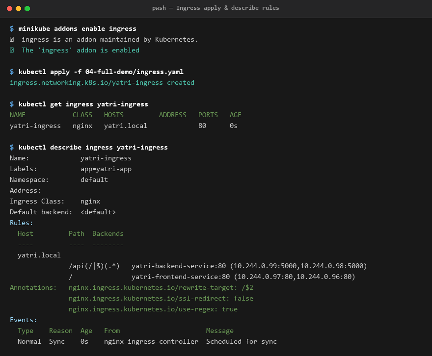
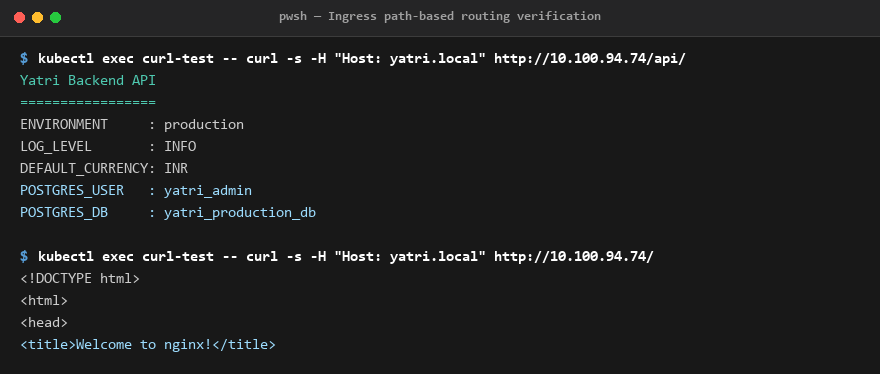

# Session 12 - Ingress, ConfigMaps and Secrets

**Name:** Jatin Mangtani  
**Enrollment Number:** 24BCS10118  

---

Used the full demo from `04-full-demo/`: a ConfigMap and a Secret feeding a backend, a frontend, and one Ingress routing `/` and `/api/` to the two different services. Output copied from my terminal.

---

## 1. ConfigMap

```bash
$ kubectl apply -f 04-full-demo/configmap.yaml
configmap/yatri-app-config created

$ kubectl get configmap yatri-app-config
NAME               DATA   AGE
yatri-app-config   5      1s

$ kubectl describe configmap yatri-app-config
Name:         yatri-app-config
Namespace:    default
Labels:       app=yatri-app
Data
====
APP_PORT:
----
5000
DEFAULT_CURRENCY:
----
INR
ENVIRONMENT:
----
production
LOG_LEVEL:
----
INFO
MAX_BOOKING_DAYS:
----
30
```



Plain key/value config, stored in the cluster instead of baked into the image. Same image can then run in dev and prod with different ConfigMaps. `describe` prints the values in full because there is nothing secret about them.

---

## 2. Secret

```bash
$ kubectl apply -f 04-full-demo/secret.yaml
secret/yatri-db-secret created

$ kubectl get secret yatri-db-secret
NAME              TYPE     DATA   AGE
yatri-db-secret   Opaque   3      0s

$ kubectl describe secret yatri-db-secret
Name:         yatri-db-secret
Namespace:    default
Labels:       app=yatri-app
Type:  Opaque
Data
====
POSTGRES_DB:        19 bytes
POSTGRES_PASSWORD:  14 bytes
POSTGRES_USER:      11 bytes
```



Notice `describe` only shows **byte counts**, not the values - so a secret does not get printed by accident in a terminal or a log.

But that is only hiding it from the output. It is not actually encrypted:

```powershell
$ kubectl get secret yatri-db-secret -o jsonpath='{.data.POSTGRES_PASSWORD}'
$ [Text.Encoding]::UTF8.GetString([Convert]::FromBase64String('c2VjcmV0cGFzc3dvcmQ='))
c2VjcmV0cGFzc3dvcmQ=secretpassword
```

Those two outputs ran together on one line because `jsonpath` prints no trailing newline - `c2VjcmV0cGFzc3dvcmQ=` is the stored value and `secretpassword` is it decoded.

Base64 is encoding, not encryption - anyone who can read the secret can decode it in one command. So the real protection is RBAC (who is allowed to read secrets), not the base64.

The yaml has the values already base64'd, made with `echo -n "secretpassword" | base64`. The `-n` matters: without it the trailing newline gets encoded too and the password comes out wrong.

(I am on PowerShell so I used `[Convert]` for the decode instead of `base64 -d`.)

---

## 3. Injecting both into a pod

The backend uses `envFrom` for the whole ConfigMap and `secretKeyRef` for each secret key. Checking inside the running container:

```powershell
$ kubectl exec deploy/yatri-backend -- env | Select-String 'ENVIRONMENT|LOG_LEVEL|CURRENCY|POSTGRES'
ENVIRONMENT=production
LOG_LEVEL=INFO
POSTGRES_USER=yatri_admin
POSTGRES_PASSWORD=secretpassword
POSTGRES_DB=yatri_production_db
DEFAULT_CURRENCY=INR
```



This is the bit that tied it together for me. ConfigMap values and Secret values both end up as **plain environment variables** inside the container - the app code just reads `os.getenv('POSTGRES_PASSWORD')` and does not know or care which one it came from. The base64 is decoded automatically on the way in.

It also shows the password sitting in plain text in `env`, which is why anyone who can exec into the pod can read it.

---

## 4. Ingress

Needed the controller first, otherwise the Ingress object just sits there doing nothing:

```bash
minikube addons enable ingress
```

```bash
$ kubectl apply -f 04-full-demo/ingress.yaml
ingress.networking.k8s.io/yatri-ingress created

$ kubectl get ingress yatri-ingress
NAME            CLASS   HOSTS         ADDRESS   PORTS   AGE
yatri-ingress   nginx   yatri.local             80      0s

$ kubectl describe ingress yatri-ingress
Name:             yatri-ingress
Labels:           app=yatri-app
Namespace:        default
Address:
Ingress Class:    nginx
Default backend:  <default>
Rules:
  Host         Path  Backends
  ----         ----  --------
  yatri.local
               /api(/|$)(.*)   yatri-backend-service:80 (10.244.0.99:5000,10.244.0.98:5000)
               /               yatri-frontend-service:80 (10.244.0.97:80,10.244.0.96:80)
Annotations:   nginx.ingress.kubernetes.io/rewrite-target: /$2
               nginx.ingress.kubernetes.io/ssl-redirect: false
               nginx.ingress.kubernetes.io/use-regex: true
Events:
  Type    Reason  Age   From                      Message
  ----    ------  ----  ----                      -------
  Normal  Sync    0s    nginx-ingress-controller  Scheduled for sync
```



The Backends column shows both rules resolved to real pod IPs - 2 backend pods on port 5000 and 2 frontend pods on port 80. If that showed `<error: endpoints not found>` it would mean the service name in the ingress is wrong.

ADDRESS is still empty because I ran this straight after applying (AGE 0s). The `Scheduled for sync` event at the bottom is the controller only just picking it up - the address fills in with the node IP a few seconds later.

---

## 5. Testing the routing

`yatri.local` is not in my Windows hosts file, so I curled the ingress controller directly from inside the cluster and set the Host header by hand:

```bash
$ kubectl exec curl-test -- curl -s -H "Host: yatri.local" http://10.100.94.74/api/
Yatri Backend API
=================
ENVIRONMENT     : production
LOG_LEVEL       : INFO
DEFAULT_CURRENCY: INR
POSTGRES_USER   : yatri_admin
POSTGRES_DB     : yatri_production_db

$ kubectl exec curl-test -- curl -s -H "Host: yatri.local" http://10.100.94.74/
<!DOCTYPE html>
<html>
<head>
<title>Welcome to nginx!</title>
```



Same IP, same port 80, two different apps - the only difference is the path. `/api/` went to the Python backend, `/` went to the nginx frontend. That is the whole point of Ingress: one entry point instead of a separate LoadBalancer (and a separate cloud bill) per service.

The `/api/` response is also proof the ConfigMap and Secret injection worked end to end - those values came out of the env vars the backend read at startup.

The `Host: yatri.local` header is what picks the rule. Without it the controller has no idea which site I want and returns a 404.

`rewrite-target: /$2` strips the `/api` prefix before forwarding, so the backend sees `/` and not `/api/`. The `(/|$)(.*)` in the path is what creates the `$2` capture group.

---

## What I learned

1. **ConfigMap vs Secret**: ConfigMap and Secret are the same idea - key/value data kept outside the image - the only real difference is that Secret is base64 encoded and hidden from `describe`. Neither is encrypted by default.
2. **Layer 7 Routing**: Ingress is layer 7 and Service is layer 4. A Service can only route by IP and port, so it cannot tell `/api` from `/`. Ingress reads the actual HTTP request (host header and path), which is why one Ingress can sit in front of many services.
3. **Ingress Controller Requirement**: An Ingress object on its own does nothing. It is only a set of rules - you need an ingress controller running (`minikube addons enable ingress`) to actually read them and route traffic.
