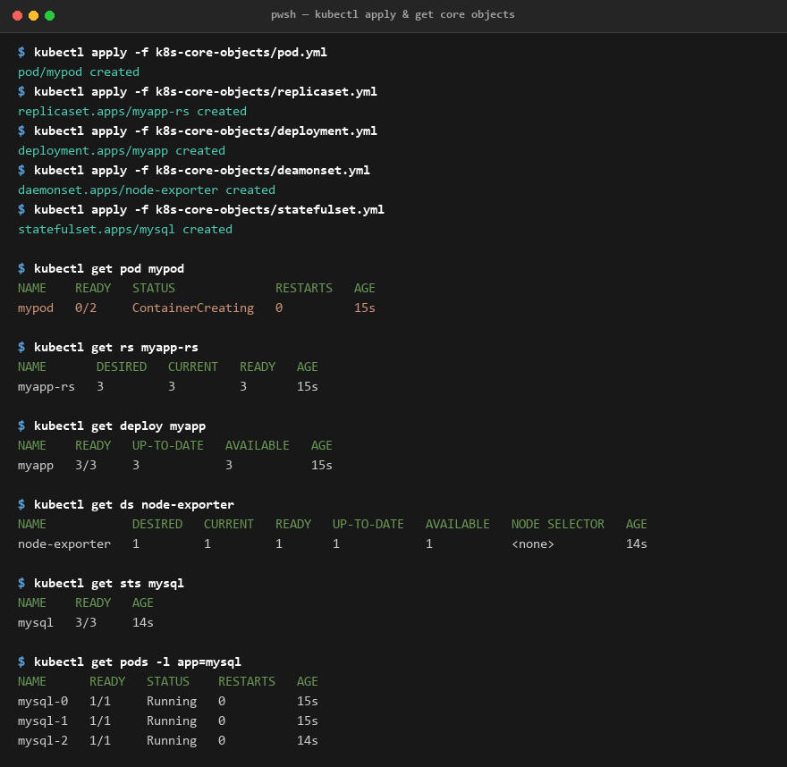
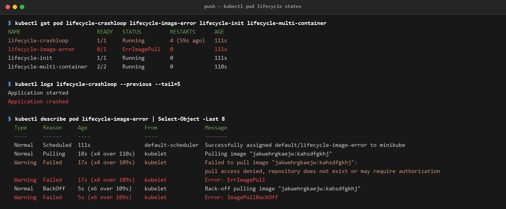
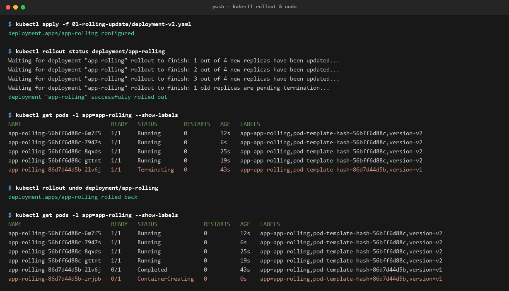

# Session 10 - Kubernetes Core Objects

**Name:** Jatin Mangtani  
**Enrollment Number:** 24BCS10118  

---

Three parts: the core objects (pod, replicaset, deployment, daemonset, statefulset), pod lifecycle states, and a rolling update with a rollback. All output copied from my terminal.

---

## 1. Core objects

```bash
kubectl apply -f k8s-core-objects/pod.yml
kubectl apply -f k8s-core-objects/replicaset.yml
kubectl apply -f k8s-core-objects/deployment.yml
kubectl apply -f k8s-core-objects/deamonset.yml
kubectl apply -f k8s-core-objects/statefulset.yml
```

```bash
$ kubectl get pod mypod
NAME    READY   STATUS              RESTARTS   AGE
mypod   0/2     ContainerCreating   0          15s

$ kubectl get rs myapp-rs
NAME       DESIRED   CURRENT   READY   AGE
myapp-rs   3         3         3       15s

$ kubectl get deploy myapp
NAME    READY   UP-TO-DATE   AVAILABLE   AGE
myapp   3/3     3            3           15s

$ kubectl get ds node-exporter
NAME            DESIRED   CURRENT   READY   UP-TO-DATE   AVAILABLE   NODE SELECTOR   AGE
node-exporter   1         1         1       1            1           <none>          14s

$ kubectl get sts mysql
NAME    READY   AGE
mysql   3/3     14s

$ kubectl get pods -l app=mysql
NAME      READY   STATUS    RESTARTS   AGE
mysql-0   1/1     Running   0          15s
mysql-1   1/1     Running   0          15s
mysql-2   1/1     Running   0          14s
```



I ran this about 15 seconds after applying, so `mypod` was still `ContainerCreating` - it has two containers (nginx + a busybox that loops printing logs) and both have to be up before it shows `2/2`. Everything else was already running.

The daemonset says `DESIRED 1` because my cluster only has one node. DaemonSet means "one copy on every node" - if I added a second node it would become 2 automatically. That is why it is used for log collectors and monitoring agents.

The statefulset pods are the interesting ones - named `mysql-0,1,2` instead of random hashes like the deployment pods get. The AGE column shows `mysql-2` is a second behind the other two, which is the ordered startup: a StatefulSet brings them up one at a time and waits for each to be ready. The images were already cached on my machine so each one took under a second, which is why the gap is so small here.

---

## 2. Deployment vs ReplicaSet

```bash
$ kubectl get pods --show-labels
NAME                     READY   STATUS    AGE   LABELS
myapp-5b9587f95d-hgrlz   1/1     Running   41s   app=myapp,pod-template-hash=5b9587f95d
myapp-5b9587f95d-shqm8   1/1     Running   41s   app=myapp,pod-template-hash=5b9587f95d
myapp-5b9587f95d-x9npt   1/1     Running   41s   app=myapp,pod-template-hash=5b9587f95d
myapp-rs-5dbp2           1/1     Running   41s   app=web
myapp-rs-l2zzn           1/1     Running   41s   app=web
myapp-rs-s9z8t           1/1     Running   41s   app=web
```

I made one deployment and one replicaset, but `kubectl get rs` showed **two** replicasets. That is because a Deployment does not manage pods itself - it creates a ReplicaSet and that manages the pods. The `pod-template-hash=5b9587f95d` label is how it keeps them apart.

So the chain is: **Deployment -> ReplicaSet -> Pods**. The extra layer is what makes rolling updates possible (part 4).

---

## 3. Pod lifecycle

```bash
$ kubectl get pod lifecycle-crashloop lifecycle-image-error lifecycle-init lifecycle-multi-container
NAME                        READY   STATUS         RESTARTS      AGE
lifecycle-crashloop         1/1     Running        4 (59s ago)   111s
lifecycle-image-error       0/1     ErrImagePull   0             111s
lifecycle-init              1/1     Running        0             111s
lifecycle-multi-container   2/2     Running        0             110s
```



### CrashLoopBackOff
Container starts, crashes, restarts, crashes again. I caught it at `Running` with 4 restarts, because it had just come back up for another try. The `RESTARTS` counter is the real giveaway, not the `STATUS`. To see why it died I need the *previous* container logs, because the current one is fresh:

```bash
$ kubectl logs lifecycle-crashloop --previous --tail=5
Application started
Application crashed
```

The "BackOff" bit means Kubernetes waits longer between each retry (10s, 20s, 40s...) so it does not hammer a broken app forever.

### ErrImagePull / ImagePullBackOff
It cannot download the image at all, so the container never starts. These two are the same problem at different stages: `ErrImagePull` is the pull failing right now, `ImagePullBackOff` is it waiting before trying again. `describe` gives the actual reason:

```powershell
$ kubectl describe pod lifecycle-image-error | Select-Object -Last 8
  Type     Reason     Age                  From               Message
  ----     ------     ----                 ----               -------
  Normal   Scheduled  111s                 default-scheduler  Successfully assigned default/lifecycle-image-error to minikube
  Normal   Pulling    18s (x4 over 110s)   kubelet            Pulling image "jakwehrgkaejw:kahsdfgkhj"
  Warning  Failed     17s (x4 over 109s)   kubelet            Failed to pull image "jakwehrgkaejw:kahsdfgkhj":
                                                              pull access denied, repository does not exist or may require authorization
  Warning  Failed     17s (x4 over 109s)   kubelet            Error: ErrImagePull
  Normal   BackOff    5s (x6 over 109s)    kubelet            Back-off pulling image "jakwehrgkaejw:kahsdfgkhj"
  Warning  Failed     5s (x6 over 109s)    kubelet            Error: ImagePullBackOff
```

The `x4 over 110s` and `x6 over 109s` counts show it retrying and giving up slower each time. Good reminder that this and crashloop look similar but are completely different - crashloop means my *code* is broken, imagepull means my *image name or registry access* is broken.

(I am on PowerShell, so `Select-Object -Last 8` instead of `tail -8`.)

### Init containers
Init containers run to completion before the main container is even allowed to start. By the time I checked, the init had already finished and the pod was `1/1 Running` - if I had looked in the first few seconds it would have said `Init:0/1` or `PodInitializing`:

```bash
$ kubectl logs lifecycle-init -c setup
Init container running
Init complete
```

Used for things like waiting on a database or downloading config first.

### Multi-container
`2/2` means both containers are up. Need `-c` to pick one:

```bash
$ kubectl logs lifecycle-multi-container -c sidecar --tail=4
Sidecar is running
```

---

## 4. Rolling update and rollback

Started on v1 (`nginx:1.24-alpine`), then applied v2 (`nginx:1.25-alpine`):

```bash
$ kubectl apply -f 01-rolling-update/deployment-v2.yaml
deployment.apps/app-rolling configured

$ kubectl rollout status deployment/app-rolling
Waiting for deployment "app-rolling" rollout to finish: 1 out of 4 new replicas have been updated...
Waiting for deployment "app-rolling" rollout to finish: 2 out of 4 new replicas have been updated...
Waiting for deployment "app-rolling" rollout to finish: 3 out of 4 new replicas have been updated...
Waiting for deployment "app-rolling" rollout to finish: 1 old replicas are pending termination...
deployment "app-rolling" successfully rolled out
```



Caught it with 4 new v2 pods running and the last v1 still terminating:

```bash
$ kubectl get pods -l app=app-rolling --show-labels
NAME                           READY   STATUS        RESTARTS   AGE   LABELS
app-rolling-56bff6d88c-6m7f5   1/1     Running       0          12s   app=app-rolling,pod-template-hash=56bff6d88c,version=v2
app-rolling-56bff6d88c-7947s   1/1     Running       0          6s    app=app-rolling,pod-template-hash=56bff6d88c,version=v2
app-rolling-56bff6d88c-8qxds   1/1     Running       0          25s   app=app-rolling,pod-template-hash=56bff6d88c,version=v2
app-rolling-56bff6d88c-gttnt   1/1     Running       0          19s   app=app-rolling,pod-template-hash=56bff6d88c,version=v2
app-rolling-86d7d44d5b-2lv6j   1/1     Terminating   0          43s   app=app-rolling,pod-template-hash=86d7d44d5b,version=v1
```

The AGE values (6s, 12s, 19s, 25s) show they were replaced **one at a time**, not all at once - roughly 6 seconds apart. The yaml sets `maxSurge: 1, maxUnavailable: 0`, so it adds one new pod first, waits for it to be ready, then kills one old one. That is how you get zero downtime.

### Rollback:

```bash
$ kubectl rollout undo deployment/app-rolling
deployment.apps/app-rolling rolled back

$ kubectl get pods -l app=app-rolling --show-labels
NAME                           READY   STATUS              RESTARTS   AGE   LABELS
app-rolling-56bff6d88c-6m7f5   1/1     Running             0          12s   app=app-rolling,pod-template-hash=56bff6d88c,version=v2
app-rolling-56bff6d88c-7947s   1/1     Running             0          6s    app=app-rolling,pod-template-hash=56bff6d88c,version=v2
app-rolling-56bff6d88c-8qxds   1/1     Running             0          25s   app=app-rolling,pod-template-hash=56bff6d88c,version=v2
app-rolling-56bff6d88c-gttnt   1/1     Running             0          19s   app=app-rolling,pod-template-hash=56bff6d88c,version=v2
app-rolling-86d7d44d5b-2lv6j   0/1     Completed           0          43s   app=app-rolling,pod-template-hash=86d7d44d5b,version=v1
app-rolling-86d7d44d5b-zrjpb   0/1     ContainerCreating   0          0s    app=app-rolling,pod-template-hash=86d7d44d5b,version=v1
```

I ran this straight after the undo so it caught the rollback in progress - the first v1 pod (`zrjpb`, 0s old) is being created while all four v2 pods are still running. It rolls back the same way it rolled forward, one pod at a time.

The important bit is the hash: the new v1 pod is `86d7d44d5b`, the **exact same hash** as the original v1 pods before the update. That is what I did not expect - the old ReplicaSet was never deleted, it was just scaled down to 0. Rolling back is really just scaling the old one back up, which is why it is instant.

---

## What I learned

1. **Deployment -> ReplicaSet -> Pod**: I always thought a Deployment made pods directly, but it makes a ReplicaSet per version and scales them up and down. Keeping the old ones at 0 replicas is what makes `rollout undo` instant.
2. **Never use a bare Pod for real work**: I tested this both ways:
   ```bash
   $ kubectl delete pod mypod
   pod "mypod" deleted from default namespace
   $ kubectl get pod mypod
   Error from server (NotFound): pods "mypod" not found

   $ kubectl delete pod myapp-rs-5dbp2
   pod "myapp-rs-5dbp2" deleted from default namespace
   $ kubectl get pods -l app=web
   NAME             READY   STATUS    RESTARTS   AGE
   myapp-rs-gqtf4   1/1     Running   0          6s
   myapp-rs-l2zzn   1/1     Running   0          5m58s
   myapp-rs-s9z8t   1/1     Running   0          5m58s
   ```
   The bare pod is just gone. The replicaset one came straight back with a new name (`myapp-rs-gqtf4`, 6s old) because the ReplicaSet noticed it was down to 2 and fixed it.
3. **Troubleshooting Diagnostics**: `RESTARTS` climbing = app problem, `0 restarts` + not ready = image or config problem. And `kubectl logs --previous` is essential because the current container logs are empty when it just restarted.
