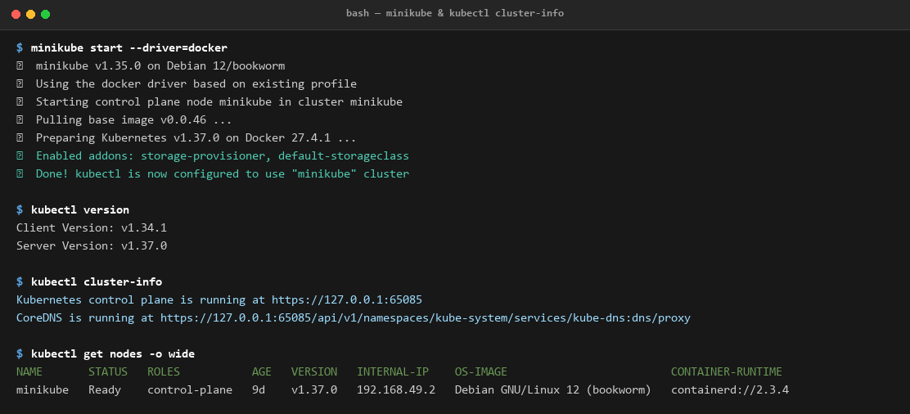
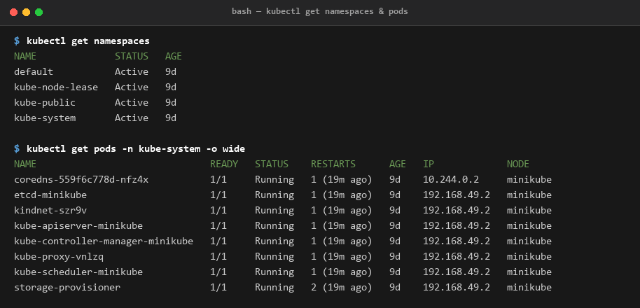
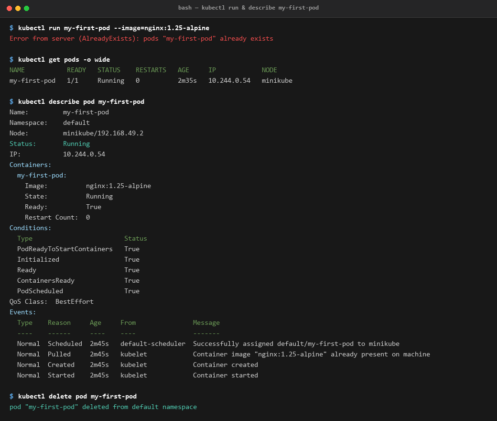

Session 9 - Kubernetes fundamentals

Set up a local cluster with minikube and went through the basic kubectl commands -
cluster info, nodes, namespaces, and running my first pod. Everything below is copied
from my terminal.

```
minikube start --driver=docker
```

---

## 1. Cluster info

```
$ kubectl version
Client Version: v1.34.1
Server Version: v1.37.0

$ kubectl cluster-info
Kubernetes control plane is running at https://127.0.0.1:65085
CoreDNS is running at https://127.0.0.1:65085/api/v1/namespaces/kube-system/services/kube-dns:dns/proxy

$ kubectl get nodes -o wide
NAME       STATUS   ROLES           AGE   VERSION   INTERNAL-IP    OS-IMAGE                         CONTAINER-RUNTIME
minikube   Ready    control-plane   9d    v1.37.0   192.168.49.2   Debian GNU/Linux 12 (bookworm)   containerd://2.3.4
```


Only one node here, so it is both the control plane and the worker. On a real cluster
these would be separate machines.

## 2. Namespaces

```
$ kubectl get namespaces
NAME              STATUS   AGE
default           Active   9d
kube-node-lease   Active   9d
kube-public       Active   9d
kube-system       Active   9d
```

`default` is where my stuff goes if I don't say otherwise. `kube-system` is where
Kubernetes runs its own components.

## 3. The architecture components are just pods

```
$ kubectl get pods -n kube-system -o wide
NAME                               READY   STATUS    RESTARTS      AGE   IP             NODE
coredns-559f6c778d-nfz4x           1/1     Running   1 (19m ago)   9d    10.244.0.2     minikube
etcd-minikube                      1/1     Running   1 (19m ago)   9d    192.168.49.2   minikube
kindnet-szr9v                      1/1     Running   1 (19m ago)   9d    192.168.49.2   minikube
kube-apiserver-minikube            1/1     Running   1 (19m ago)   9d    192.168.49.2   minikube
kube-controller-manager-minikube   1/1     Running   1 (19m ago)   9d    192.168.49.2   minikube
kube-proxy-vnlzq                   1/1     Running   1 (19m ago)   9d    192.168.49.2   minikube
kube-scheduler-minikube            1/1     Running   1 (19m ago)   9d    192.168.49.2   minikube
storage-provisioner                1/1     Running   2 (19m ago)   9d    192.168.49.2   minikube
```



This was the thing that actually made architecture click for me. All the components from
the diagram are real containers running in the cluster:

- `kube-apiserver` - the only thing you talk to, kubectl goes here
- `etcd` - database holding the whole cluster state
- `kube-scheduler` - picks which node a new pod goes on
- `kube-controller-manager` - loops that fix the difference between what I asked for and what exists
- `kubelet` - not a pod, it runs on the node itself and starts the containers
- `kube-proxy` - one per node, sets up the network rules for services
- `coredns` - DNS inside the cluster

## 4. Node capacity and api-resources

```
$ kubectl describe node minikube | sed -n '/^Capacity/,/^System Info/p'
Capacity:
  cpu:                28
  memory:             7977660Ki
  pods:               110
Allocatable:
  cpu:                28
  memory:             7977660Ki
  pods:               110

$ kubectl api-resources | head -12
NAME                     SHORTNAMES   APIVERSION   NAMESPACED   KIND
configmaps               cm           v1           true         ConfigMap
endpoints                ep           v1           true         Endpoints
namespaces               ns           v1           false        Namespace
nodes                    no           v1           false        Node
pods                     po           v1           true         Pod
```

`Allocatable` is what the scheduler is allowed to hand out - max 110 pods on this node.
`api-resources` is handy because it gives the short names, so I can type `kubectl get po`
instead of `kubectl get pods`.

## 5. My first pod

```
$ kubectl run my-first-pod --image=nginx:1.25-alpine
Error from server (AlreadyExists): pods "my-first-pod" already exists

$ kubectl get pods -o wide
NAME           READY   STATUS    RESTARTS   AGE     IP            NODE
my-first-pod   1/1     Running   0          2m35s   10.244.0.54   minikube
```



Got `AlreadyExists` because I had already created this pod on an earlier try and forgot to
delete it. Pod names have to be unique in a namespace.

```
$ kubectl describe pod my-first-pod
Name:         my-first-pod
Namespace:    default
Node:         minikube/192.168.49.2
Status:       Running
IP:           10.244.0.54
Containers:
  my-first-pod:
    Image:          nginx:1.25-alpine
    State:          Running
    Ready:          True
    Restart Count:  0
Conditions:
  Type                        Status
  PodReadyToStartContainers   True
  Initialized                 True
  Ready                       True
  ContainersReady             True
  PodScheduled                True
QoS Class:  BestEffort
Events:
  Type    Reason     Age     From               Message
  ----    ------     ----    ----               -------
  Normal  Scheduled  2m45s   default-scheduler  Successfully assigned default/my-first-pod to minikube
  Normal  Pulled     2m45s   kubelet            Container image "nginx:1.25-alpine" already present on machine and can be accessed by the pod
  Normal  Created    2m45s   kubelet            Container created
  Normal  Started    2m45s   kubelet            Container started

$ kubectl delete pod my-first-pod
pod "my-first-pod" deleted from default namespace
```

The Events list at the bottom of `describe` is basically the pod's story in order -
scheduler picked a node, kubelet got the image, container started. When something breaks
this is the first place to look.

This time it says the image was **already present on machine** instead of pulling it,
because it was cached from my earlier run. That is why the pod was ready almost instantly -
no download step.

The Conditions block is the other useful bit: `PodScheduled -> Initialized ->
ContainersReady -> Ready`, all True. If a pod is stuck, whichever one is False tells you
how far it got.

---

What I learned:

Kubernetes is declarative - I say what I want and the controllers keep working until the
cluster matches. I don't tell it "start a container on node 2", I say "I want this pod"
and the scheduler figures out where.

The control plane isn't magic, it's just pods in `kube-system`. Seeing etcd and the
apiserver in a normal `kubectl get pods` output made the whole architecture diagram
make sense.

`kubectl describe` is more useful than `kubectl get` when something is wrong, because
of the Events section at the bottom.
